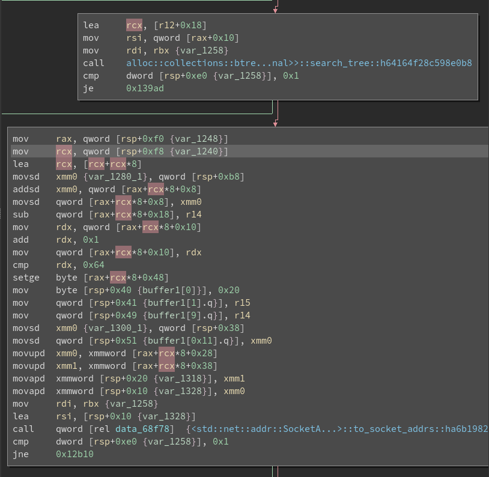

# Market Maker

## Foreword

This writeup is for the `Hard` reversing challenge `Market Maker` of the Hacklu CTF 2021 edition. The challenge was solved by only 1 Team: organizers.

I am the author of this challenge and will showcase a few tips and tricks to reversing Rust code while going throught my "strategie" of 
solving reversing CTF challenges. By no means is this THE intended way of figuring stuff out.
This challenge was developed with the intention that it could be solved via a variatiy of strategies.

I will be providing an solving POC and the source code at the end of this writeup.

## Idea

Having spend the last year being addicted to financial markets i was particuallary happy to be create a challenge for this years (2021) Hack.lu CTF theme: 
Stock Market.

Having talked with participants after the competition it became clear that i created the challenge with a bias. Namely knowledge of the inner workings of financial markets 
and the role of the so called "market maker", were not common knowledge.
Having said this i still feel the need to point out that this was a _`Hard`_ reversing challenge.

To give some history about the challenge what is the role of a market maker? 
A market maker servers to provide liquidity and depth to the market, profiting from the difference in the bid-ask spread.
Or in laymens termns: Market makers are the reason we are able to buy and sell stocks at any time without impacting the markets too much.

A little example:

I want to buy 1 share of Apple. At the time of writing this the current bid to buy Apple is at `$148.09` and the offer is at `$148.10`. Meaning
I can go a ahead and buy 1 share of Apple for `$148.10` and sell it for `$148.09`, loosing 1 cent in return. This 1 cent is the profit for the market maker
for quoting me these prices.

Over the course of the day/month/year this will add up, netting the maker a profit. 

So my idea was to create an simple exchange server, where every participant could trade with each other. The goal was for each participant to
get themselfs to a "market maker" position, aka providing a certain amount of liquidity to the market, in order to unlock an additional 
order method, creating the possiblity to sell the ask, and buy the bid (you normally buy the ask, and sell the bid). 
This order can be abused to generate huge amounts of cash, leading to the output of the flag.

## Analyzing the Binary

### Basic Rust ABI

Being written in Rust the reverse engineer is faced with a few more challenges. Rust is _relatively_ new and its ABI, while similar,
isn't exactly the same as C and C++, which most people have a strong foundation in reversing. 

To start reversing Rust first it is recommendable to use the right tools, for instance the following images all show the disassembled output of the first lines 
of main. From top to bottom: IDA 7.6, IDA 7.0 and Binary Ninja. Notice how in 7.6 IDA makes awfull assumptions about the stack? 7.0 and Binary Ninja 
dont display that error, while Binja also aplies function arguments correctly. 

<p align="center"></p>

Thus from here out on all revering will be done via binja.

Whats noteable about the decompilation shown is that we already get to see _where_ the flag is stored. The key giveaway being the `std::fs::read_to_string("flag")` 
call. Note how this function takes 3 parameters? This is a crucial part of understanding Rust memory representation and i can only recommend you checkout 
this section of [cheats.rs](https://cheats.rs/#basic-types)

Firstly strings are not null terminated in Rust. This is true for both the dynamic type `String` as well as the static constant `&str`. In the 
cheats.rs section you can see `&str` having two 8 byte fields, one for the pointer and one for the length. Those make up the latter 2 parameters. 
A quick look into Rust doc reveals that `read_to_string` returns `Result<String>`. `String` is the same as `Vec<u8>` which consists of 
an 8 byte heap pointer, a 8 byte big size and a 8 byte big capacity, thus taking up 24 bytes of memory. 
But how many bytes does the `Result` have? We can simply figure that out by either going to an online playground or creating a toy project 
and print the total size of the type construct:


<p align="center"></p>

This type is obviously too big to fit in the return register `rax`. Thus the compiler deploys return value optimization, passing the return value as 
a pointer to the function. This is the first argument. 


### Following the flag

There are a few strategies on figuring out when the flag is sent to us. From the disassembly we derive that the first 8 byte of the `Result<String>` combo 
are for the Result tag, while the latter 24 bytes are for the String. This makes it easy to lookup the _real_ memory location of the flag. Following the
xrefs we arrive at this location:

<p align="center"></p>

Here we have to be careful! Those familiar with Rust know that `drop` referes to destructing and free'ing an element. So why would the flag
be passed to such a function? Turns out that the name binja shows us is not that all correct. In truth the whole function name is `<alloc::collections::btree::map::DrainFilter<K,V,F> as core::ops::drop::Drop>::drop::h3e0e50ed4dbdedc4`.
Which makes more sense, a lambda function to the drain filter method. 

#### Power of graph view

Okay i'll have to admit, after looking at it again, even with a side by side source view i have no idea on what's happening by only looking at the decompilation.
However in times where the decopmilation gets too complex, especially in implementation gritty details like this one, opting to the disassembler graph is 
a much more pleasent reversing experience. An example:

<p align="center"></p>

This is the whole condition check whether the flag is send. We can safely ignore the bottom 3 checks which do some
ip querying. Why? because we wouldn't have a say in that anyways. The alternative branch in the last check even says `no addresses to send data to`, which in the 
current context doesn't make sense. It could potentially still be part of the challenge, but it's rather unlikly and would require more knowledge of the program.

What is catching my eye immedialty are the first 2 basic blocks. Notice how `r12` is definitley an array, `rbp` an index and different fields of a unknown struct 
are checked? In the first basic block we compare whether the offset `+0x8` is bigger than `10000000.0` (`xmm1` is assinged once in the function prologue with the floating point representation of `10000000.0`),
and in the second basic block we compare if offset `+0x48` is greater than 0. Sure seems like our condition for getting the flag, time to see how we're going to interact with the program.

### Communication

#### Sending

A simply xref on `UdpSocket::recv_from` shows that the only place data 
is recv'd is in `client_rx`. The `recv_from` function is very similar to it's C equivalent and i've already talked somewhat about the Rust abi, so i won't go over that again.
The following screenshot shows the main handeling of our packet.

<p align="center"></p>

Essentially we are sending something in the lines of:
```rust
struct SendPacket {
  ptype: u8,
  arg1: usize,
  arg2: usize
}
```

However `ptype == 3` is only available to us if `SomeBool` has been set. Which is stored at offset `+0x40` of the type stored in the `BTreeMap`.

<p align="center"></p>

#### Receiving 

First get all location where data is sent. You can get a list of by xreffing `std::sys_common::net::UdpSocket::send_to`. You'll likely see 7 occurances where this function is called.
Four times in `main`, once in another `UdpSocket::send_to` method and in the `DrainFilter` lambda where we are sent the flag.
So glancing throught the 4 locations in main we see that there are only 2 unique ways the method is called. Once with a buffer of length `0x1000` and thrice with a buffer of length
`0x19`.

For the packets of size `0x19` we face a familiar structure as with `SendPacket`. First we have one byte which could very much be the type of the package,
after which we have three 8 byte values:

```rust
struct RecvPacket {
  ptype: u8,
  arg1: usize,
  arg2: usize,
  arg3: usize,
}
```

The types and values of those fields can be "guessed" if we speak a few frames with the challenge. 
For the `0x1000` packet i invite you to figure it out on your own, In reality it only has a few fields. 


### Type Information from Generic Methods

Okay, so we've got to a point where we know _what_ we can send and what we would be receiving. However this is still no childs play.
We still have to deal with so much boiler plate code and Rust internal checks 
that this is equal to finding a needle in the haystack. 

Especially all those calls to `BTreeMap` methods, panicking, and strange loops such as this one

<p align="center"></p>

However i have another trick in the bag for you. Thanks to Rust generic types such as `BTreeMap` the binary will have a method for each type.

<p align="center"></p>

So in a we can be pretty sure that there are only 2 types stored in a `BtreeMap`. 
Not only that but we are able to get direct type information about the both generic `K` and `V` from the `Drop` trait:

<p align="center"></p>

We got the names of both data types a `BTreeMap` is used for, we don't know the members, but we can start applying the usual reverse engineering
trick to get to the ground of that; i.e we can start by finding construction places or areas where the struct is used.

### Inlined Lambdas

Picking up from the last chapter lets take a look at the places where an element is added to the `marketmaker::Client` map. 
There's this function in `marketmaker::client_rx` called `btree::map::entry::Entry<K, V>::or_insert_with` which, if you look at the docs,
takes a lambda such that it returns a `V`. However we don't see a function being passed to the function at all, what's happening here?

Turns out that Rust just inlines the lambda to where it's called. This _inside_ the `or_insert_with` function. The same thing happend 
with the `DrainFilter` lambda where we are sent the flag. Because this pattern is pretty common it should serve as a reminder 
that lambda parameters are inlined in the function to call. I say this because commming from a C or C++ reversing perspective
we tend to ignore library functions, as they do not contain custom code.

We can even abuse this fact to pull up source code of the library function and see exactly where the lambda would be called.

This is the source code for `or_insert_with`:

<p align="center"></p>

and this the disassembled one found in the binary.

<p align="center"></p>


Notice how there's is only 1 check before we start calling into `SocketAddr::ip`, why would such a method be inside an map insert?
If we check the source again it's clear that this must be our lambda function being passed to the method. And we can already extract information 
from it. For once we can recognize offset `+0x0` and `+0x40`, we previously identified as being a constraint to the flag printing, being initialized.

But wait, wasn't that at offset `+0x8` and `+0x48`? If you look closeley the struct is starting at `rsp+0x8` so the offsets aren't really `+0x8` and `+0x48` but `+0x0` and `+0x40`.
This is also inline with the offset of `SomeBool`, indicating that we pass both the check for the `ptype == 3` command and the flag check.
I will talk about why the offset is different in the flag checker, and why what i've just said is really true, later.


## Trial and Error

The matter of fact is that so far i've only showcased a miniscular amount of 
code, which I hope is comprehensible on why I picked/found these snippets. Nonethelss there is so much code flying 
around which acutally IS part of the challenge. Just well hidden between boiler plate. And to be honest with you
i don't want to go even into that. Why? because i have an inherent bias on what the code is suppose to do. I know the source. Thus 
piecing together heaviliy optimized code won't be that hard as someone without any knowledge about that. The following process ought to
just as easy with dynamic analysis.

We already have gained a lot of hints about the nature of the binary.
That we're talking to an exchange server, getting regular updates on our client as well as getting a subset of the [ order book ]( https://www.investopedia.com/terms/o/order-book.asp ).
How do i know it's an order book and client updates? By the "leaked" type names in the `BTreeMap`. And if you've only had a suspicion so far about the contents of the packets,
the following process will definitely make that much more clear.

Lets send a sample packet like this:
```python
def pk1(arg1, arg2):
    return b"\x00" + p64(arg1 % 2 ** 64) + p64(arg2 % 2 ** 64)

r.send(pk1(0, 0));
```

we get the the following data send back to us:

```python
[DEBUG] Received 0x1000 bytes:
    00000000  c1 00 00 00  00 00 00 00  00 00 00 00  00 00 00 00  │····│····│····│····│
    00000010  00 00 00 00  00 00 00 00  00 00 00 00  00 00 00 00  │····│····│····│····│
    *
    00000800  c2 00 00 00  00 00 00 00  00 00 00 00  00 00 00 00  │····│····│····│····│
    00000810  00 00 00 00  00 00 00 00  00 00 00 00  00 00 00 00  │····│····│····│····│
    *
    00001000
[DEBUG] Received 0x19 bytes:
    00000000  21 00 00 00  00 65 cd cd  41 00 00 00  00 00 00 00  │!···│·e··│A···│····│
    00000010  00 00 00 00  00 00 00 00  00                        │····│····│·│
    00000019 
```

One packet should be the order book and the other our client information. We can confirm this by checking that 
`0xc1` and `0xc2` are set when the buffer for the `0x1000` packet is popullated. If you remember the client initialization
or are familiar with ieee 754 you can already guess what the "strange" number in the second packet is.
The answer is that it's the floating point representation of `1000000000.0`.

```python
>>> import struct
>>> def uf64(f):
...     return struct.unpack("<d", f)[0]
...
>>> uf64(b"\x00\x00\x00\x00\x65\xcd\xcd\x41")
1000000000.0
>>> 
```

Well why is it `1000000000.0` and not `10000.0`? That's because if you remember in the client constructor it's checking if the 
connection comes from localhosts and gives the client more cash. I've originally put that there to "take control" over the market if 
something strange where to happen. 


We can now try to see what impact each packet has to the state, i've gone ahead and already extracted the correct type information for each command.
This can be derived in the `client_rx` function.

```python
def pk0(arg1, arg2):
    return b"\x00" + f64(arg1 % 2 ** 64) + p64(arg2 % 2 ** 64)
def pk1(arg1):
    return b"\x01" + p64(arg1 % 2 ** 64) 
def pk2(arg1):
    return b"\x02" + p64(arg1 % 2 ** 64) 
def pk3(arg1, arg2):
    return b"\x03" + p64(arg1 % 2 ** 64) + f64(arg2 % 2 ** 64)
```

Note that im restarting the binary after each try.
 
Try #1
```python
r.send(pk0(2, 10));
```

```python
[DEBUG] Received 0x1000 bytes:
    00000000  c1 00 00 00  00 00 00 00  40 0a 00 00  00 00 00 00  │····│····│@···│····│
    00000010  00 00 00 00  00 00 00 00  00 14 00 00  00 00 00 00  │····│····│····│····│
    00000020  00 00 00 00  00 00 00 00  00 00 00 00  00 00 00 00  │····│····│····│····│
    *
    00000800  c2 00 00 00  00 00 00 00  00 00 00 00  00 00 00 00  │····│····│····│····│
    00000810  00 00 00 00  00 00 00 00  00 00 00 00  00 00 00 00  │····│····│····│····│
    *
    00001000
[DEBUG] Received 0x19 bytes:
    00000000  21 00 00 00  00 65 cd cd  41 00 00 00  00 00 00 00  │!···│·e··│A···│····│
    00000010  00 00 00 00  00 00 00 00  00                        │····│····│·│
    00000019
[DEBUG] Received
```

Perceived result: Client remains the same, order book changed.

Try #2
```python
r.send(pk1(2))
```

```python
[DEBUG] Received 0x1000 bytes:
    00000000  c1 00 00 00  00 00 00 00  00 00 00 00  00 00 00 00  │····│····│····│····│
    00000010  00 00 00 00  00 00 00 00  00 00 00 00  00 00 00 00  │····│····│····│····│
    *
    00000800  c2 00 00 00  00 00 00 00  00 00 00 00  00 00 00 00  │····│····│····│····│
    00000810  00 00 00 00  00 00 00 00  00 00 00 00  00 00 00 00  │····│····│····│····│
    *
    00001000
[DEBUG] Received 0x19 bytes:
    00000000  21 00 00 00  ff 64 cd cd  41 00 00 00  00 00 00 00  │!···│·d··│A···│····│
    00000010  00 02 00 00  00 00 00 00  00                        │····│····│·│
    00000019 
```

Perceived result: Client changed, order book unchanged. Client money is now at `999999998.0` and we have another 
field that is `2`. Given that `2` is also the parameter of packet we've send we can make an educated guess that this is 
the current position.

Try #3 

```python
r.send(pk2(2));
```

```python
[DEBUG] Received 0x1 bytes:
    00000000  fd                                                  │·│
    00000001
[DEBUG] Received 0x1000 bytes:
    00000000  c1 00 00 00  00 00 00 00  00 00 00 00  00 00 00 00  │····│····│····│····│
    00000010  00 00 00 00  00 00 00 00  00 00 00 00  00 00 00 00  │····│····│····│····│
    *
    00000800  c2 00 00 00  00 00 00 00  00 00 00 00  00 00 00 00  │····│····│····│····│
    00000810  00 00 00 00  00 00 00 00  00 00 00 00  00 00 00 00  │····│····│····│····│
    *
    00001000
[DEBUG] Received 0x19 bytes:
    00000000  21 00 00 00  00 65 cd cd  41 00 00 00  00 00 00 00  │!···│·e··│A···│····│
    00000010  00 00 00 00  00 00 00 00  00                        │····│····│·│
    00000019 
```

Perceived result: Client and order book unchanged, we got `0xfd` byte which we haven't observed before. An error message?

Try #4

```python
r.send(pk3(2))
```

```python
[DEBUG] Received 0x1000 bytes:
    00000000  c1 00 00 00  00 00 00 00  00 00 00 00  00 00 00 00  │····│····│····│····│
    00000010  00 00 00 00  00 00 00 00  00 00 00 00  00 00 00 00  │····│····│····│····│
    *
    00000800  c2 00 00 00  00 00 00 00  00 00 00 00  00 00 00 00  │····│····│····│····│
    00000810  00 00 00 00  00 00 00 00  00 00 00 00  00 00 00 00  │····│····│····│····│
    *
    00001000
[DEBUG] Received 0x19 bytes:
    00000000  21 00 00 00  00 65 cd cd  41 00 00 00  00 00 00 00  │!···│·e··│A···│····│
    00000010  00 00 00 00  00 00 00 00  00                        │····│····│·│
    00000019 
```

Perceived result: Client and order book unchanged, no error message. However if you remember this packet was only available to us if 
`SomeBool` is true. 

## Rust ABI again

As discussed previously `SomeBool` is at offset `+0x40` of `Client`.

<p align="center"></p>

Are there other references to that offset? Well for once we have to know where the the struct is used. My approach is to 
find places where `btree` functions called. But remember we have 2 `BTreeMap` one the value type of `Client` and one with the 
value type of `Vec<BookEntry>`. Thankfully the difference between those two are big enough to differentiate between.

Especially intereseting for us is the call to `next_unchecked` near the `send_to` sending the `0x21` packet. As Client information 
is present in that packet, we should see access to that tree in close proximity.
This function is used in the interator trait and is returning a `(&K, &V)` pair. We know that the Client `BTreeMap` has a the `Client` struct
as it's value and takes a `SocketAddr` as key. In this case 2 pointers are returnd. In such cases Rust will use `rax` as the first register
and `rdx` for the second return value. Binary Ninja shows us this perfectly:

<p align="center"></p>

What sticks out is the fact the content of the entire `0x21` packet is just the first `0x18` bytes of the `Client` structure.

Okay but we still don't know anything about `SomeBool`. And the question still stands why the checks are performed on differnt offsets.
To truely understand why this is happening i am going to talk about the std library

This is the function `BTreeMap::get`:

```rust
fn get(&self, key: &Q) -> Option<&K> {
    let root_node = self.root.as_ref()?.reborrow();
    match root_node.search_tree(key) {
        Found(handle) => Some(handle.into_kv().0),
        GoDown(_) => None,
    }
}
```

It'll search the tree for the given `key` and returns a `handle`. The `handle` has the type `Handle<NodeRef<...>, ...>`.
Which is defined as follows:

```rust
pub struct Handle<Node, Type> {
    node: Node,
    idx: usize,
    _marker: PhantomData<Type>,
}
```
You can ignore the `PhantomData` field, it's only used for the borrow checker and has no size.

So `Node` in this case is `NodeRef<...>` which is defined like this:

```rust
pub struct NodeRef<BorrowType, K, V, Type> {
    height: usize,
    node: NonNull<LeafNode<K, V>>,
    _marker: PhantomData<(BorrowType, Type)>,
}
```

where `NonNull` is a pointer which cannot be `null`. 

And last but not least `LeafNode<K, V>`

```rust
struct LeafNode<K, V> {
    parent: Option<NonNull<InternalNode<K, V>>>,
    parent_idx: MaybeUninit<u16>,
    len: u16,
    keys: [MaybeUninit<K>; CAPACITY],
    vals: [MaybeUninit<V>; CAPACITY],
}
```

This is the disassembled usage of `BTreeMap::get`:

<p align="center"></p>

As we can see quite a lot got inlined, so lets unwrap it. Again we encounter return optimisation and because 
the return type is an `Option` the first `8` bytes are resered for the `Option` type. The next field 
is the `Node` type of the `Handle` type, which is `NodeRef` which it's first field is the `height` field. 
After the `height` we have the pointer to the node, and after that we have the `idx` field of the `handle`.
So the stack structure looks like this:

```rust
struct ReturnValues {
  option_tag: usize,            // rsp + 0xe0
  height: usize,                // rsp + 0xe8
  nodeptr: NonNull<LeafNode>,   // rsp + 0xf0
  idx: usize,                   // rsp + 0xf8
}
```

From the screenshot you can tell that our `Client` type must be `9 * 8 == 72` bytes long. We first multiply the index by `9` and then by `8` again.
Then add to the pointer + `0x8` to get the `Client` object. Why `0x8`? isn't this a pointer to `LeafNode`? Yes, yes it is. You might 
be wondering why offset `0x8` is enough to get to the array of values. Well for once you can ignore `parent_idx` and `len`. Why? Well
because of padding reasons. Pointers and usize's like to be 8 byte aligned. If we respect that alignment and have datatypes that
are smaller than 8 bytes between such fields we create unused padding bytes. By grouping the smaller types at the end Rust is
able to reduce struct sizes.

But what about the `Key` array? Well... no idea. But atleast we've solved the mistery about the strange `+0x8` offset, we simply skip the `parent` pointer.
But isn't that an `Option` and shouldn't that take two 8 byte fields like i mentioned throughout the blog post? Well yes,
[but actually no]( https://doc.rust-lang.org/std/ptr/struct.NonNull.html) . Money quote: `"Option<NonNull<T>> has the same size as *mut T"`.


This certinaly has been a lenghty excursion, but i hope it was worth it. In reality i probably wouldn't have looked up all this stuff
in the std library, but instead just attached a debugger and verified which fields are being accessed. 


## Solving that damend thing already

Now that we have a solid understanding of Rust internals and the challenge lets aim to get rich and get the flag.

### Setting SomeBool

Referring back to the last screenshot `SomeBool` (here at offset `0x48`) is set if `Client+0x8` is greater than `100`. What's good about this field 
is that we are getting the value of this field send to us in the `0x21` packet.

Instead of tedious reverse engineering the packet handling and matching engine again, I am going to shortcut this by applying some
eductated guesses on how to increase that value.
The goal of this challenge is probably to provide liquidity to the market, we can do that by using `pk0` and setting elements in the order book.

After some trial and error we can observe that this pattern is increasing `Client+0x8` by `1`:

```python
r.send(pk1(2)); # recap: Get 2 shares 
r.send(pk0(2, 2)); # Buy 2 shares for 2 money
r.send(pk0(2, -2)); # Sell 2 shares for 2 money
```

So lets do that a `100` times and we should be able to use the command we couldn't use previously.

```python
for _ in range(120):
    r.send(pk1(2))
    r.send(pk0(2, 2))
    r.send(pk0(2, -2))

time.sleep(2)
r.send(pk3(2, 2))
time.sleep(1000);
```

```python
[DEBUG] Sent 0x11 bytes:
    00000000  03 02 00 00  00 00 00 00  00 00 00 00  00 00 00 00  │····│····│····│····│
    00000010  40                                                  │@│
    00000011
[DEBUG] Received 0x1 bytes:
    00000000  fc                                                  │·│
    00000001 
```

Ayyy, we got an error message.

### Getting rich

So but what did we actually achieve by enabling this command? Well another good time to figure out what it's doing by looking at what's changing isn't it ?

We already know that it is not doing anything if the order book is empty. So what's the interaction with something in the order book? 


```python
r.send(pk1(2)) # this is reducing my balance by 4 and increasing my position by 2
r.send(pk0(20, -2)) # This is creating an entry in the book where i would sell 2 shares for 20 money each
r.send(pk0(10, 2)) # This is creating an entry in the book where i would buy 2 shares for 10 money each
r.send(pk3(2, 20)) # I don't konw what this does
``` 

```python
CLIENT PACKET
  balance: 1000000004.0
  SomeNum: 116
  position: 0
[DEBUG] Sent 0x9 bytes:
    00000000  01 02 00 00  00 00 00 00  00                        │····│····│·│
    00000009
[DEBUG] Sent 0x11 bytes:
    00000000  00 00 00 00  00 00 00 34  40 fe ff ff  ff ff ff ff  │····│···4│@···│····│
    00000010  ff                                                  │·│
    00000011
[DEBUG] Received 0x12 bytes:
[DEBUG] Sent 0x11 bytes:
    00000000  01 02 00 00  00 00 00 00  00 00 00 00  00 00 00 00  │····│····│····│····│
    00000010  f0 3f                                               │·?│
    00000012
    00000000  00 00 00 00  00 00 00 24  40 02 00 00  00 00 00 00  │····│···$│@···│····│
    00000010  00                                                  │·│
    00000011
[DEBUG] Received 0x12 bytes:
[DEBUG] Sent 0x11 bytes:
    00000000  01 00 7f 17  00 20 4e 00  00 00 00 00  00 00 00 00  │····│· N·│····│····│
    00000010  00 00                                               │··│
    00000012
    00000000  03 02 00 00  00 00 00 00  00 00 00 00  00 00 00 34  │····│····│····│···4│
    00000010  40                                                  │@│
    00000011
[DEBUG] Received 0x12 bytes:
    00000000  01 00 80 17  00 10 27 00  00 00 00 00  00 00 00 00  │····│··.·│····│····│
    00000010  00 00                                               │··│
    00000012
[DEBUG] Received 0x19 bytes:
    00000000  20 7f 17 00  20 4e 00 00  00 02 00 00  00 00 00 00  │ ···│ N··│····│····│
    00000010  00 00 00 00  00 00 00 34  40                        │····│···4│@│
    00000019
[DEBUG] Received 0x12 bytes:
    00000000  01 02 02 00  00 00 00 00  00 00 00 00  00 00 00 00  │····│····│····│····│
    00000010  34 40                                               │4@│
    00000012
[DEBUG] Received 0x19 bytes:
    00000000  21 00 00 00  29 65 cd cd  41 75 00 00  00 00 00 00  │!···│)e··│Au··│····│
    00000010  00 fe ff ff  ff ff ff ff  ff                        │····│····│·│
    00000019
CLIENT PACKET
  balance: 1000000082.0
  MagicNum: 117
  position: 18446744073709551614 
```


I've taking the freedom to pretify the `0x21` packet. And would you look at that, money increased and position overflowed.
Unfortuatly if you play around with that a bit more it doesn't seem to convert into anthing. You can only guess (or reverse) that the overflow
isn't working in our favor. Lets try again without overflowing.

```python
r.send(pk1(2))
r.send(pk0(200, -2))
r.send(pk3(1, 200))
```
 
```python
CLIENT PACKET
  balance: 999999807.0
  MagicNum: 115
  position: 0
[DEBUG] Sent 0x9 bytes:
    00000000  01 02 00 00  00 00 00 00  00                        │····│····│·│
    00000009
[DEBUG] Sent 0x11 bytes:
    00000000  00 00 00 00  00 00 00 69  40 fe ff ff  ff ff ff ff  │····│···i│@···│····│
    00000010  ff                                                  │·│
    00000011
[DEBUG] Received 0x12 bytes:
    00000000  01 02 00 00  00 00 00 00  00 00 00 00  00 00 00 00  │····│····│····│····│
    00000010  f0 3f                                               │·?│
    00000012
[DEBUG] Received 0x12 bytes:
    00000000  01 00 b6 24  00 40 0d 03  00 00 00 00  00 00 00 00  │···$│·@··│····│····│
    00000010  00 00                                               │··│
    00000012
[DEBUG] Sent 0x11 bytes:
    00000000  03 01 00 00  00 00 00 00  00 00 00 00  00 00 00 69  │····│····│····│···i│
    00000010  40                                                  │@│
    00000011
[DEBUG] Received 0x19 bytes:
    00000000  20 b6 24 00  40 0d 03 00  00 01 00 00  00 00 00 00  │ ·$·│@···│····│····│
    00000010  00 00 00 00  00 00 00 69  40                        │····│···i│@│
    00000019
[DEBUG] Received 0x12 bytes:
    00000000  01 02 01 00  00 00 00 00  00 00 00 00  00 00 00 00  │····│····│····│····│
    00000010  69 40                                               │i@│
    00000012
[DEBUG] Received 0x1000 bytes:
    00000000  c1 00 00 00  00 00 00 24  40 0e 00 00  00 00 00 00  │····│···$│@···│····│
    00000010  00 00 00 00  00 00 00 00  40 a0 13 00  00 00 00 00  │····│····│@···│····│
    00000020  00 00 00 00  00 00 00 00  00 00 00 00  00 00 00 00  │····│····│····│····│
    *
    00000800  00 00 00 00  00 00 00 40  00 00 00 00  00 00 00 40  │····│···@│····│···@│
    00000810  00 00 00 00  00 00 34 40  00 00 00 00  00 00 34 40  │····│··4@│····│··4@│
    00000820  00 00 00 00  00 00 69 40  00 00 00 00  00 00 69 40  │····│··i@│····│··i@│
    00000830  00 00 00 00  00 00 00 00  00 00 00 00  00 00 00 00  │····│····│····│····│
    *
    00001000
[DEBUG] Received 0x19 bytes:
    00000000  21 00 00 80  66 65 cd cd  41 74 00 00  00 00 00 00  │!···│fe··│At··│····│
    00000010  00 00 00 00  00 00 00 00  00                        │····│····│·│
    00000019
CLIENT PACKET
  balance: 1000000205.0
  MagicNum: 116
  position: 0 
```

Wow, nice. can we chain it? absolutely! While im not going to paste another dump but you can try for yourself or checkout the poc and source at the end of the writup.


# Rust TIPS

I feel like i ought to gather all the Rust reversing tips i've scattered throught this text again.

- Compare disassemblers.
- Know Result/Option types and how they are returned.
- Know return value optimization.
- Know Memory layout of basic types such as `&str`.
- Don't simply  Rust the decompiler, optimized code can get very messey and it's easier to look at the graph view.
- Lambda parameter are inlined in the function itself.
- Obtain type information from mangled function names.
- Obtain type amount from generic functions.
- Std library is open source, use it to your advantage.
- Do not get lost in details. Alot of it is part of Rust's safety model.

# Post Mortem

This challenge was thought out to be mirroring some real world project. There was no clear line from start to finish and i think 
that threw alot of people off. I think that real world reversing is a tad bit different from your normal ctf challenge as much more creativity 
is necessary. And by creativity i don't mean guessing, just that this isn't something where you throw some numbers is z3 and wait.
Or let angr autosolve it for you. As part of this my proposed solution did infact contain pieces which could be described as an 
information bias or guess work. However I did not get into how you could've accelerated that process with dynamic analysis, debugging your
commands on the fly. 

Still the absolut abundance of inlined function wasn't the best reversing experience, and I accept that. 


# Source

[here](./main.rs)

# POC 

```python
import threading
import struct
import time
from pwn import *

def f64(f):
    return struct.pack("<d", f)

def uf64(f):
    return struct.unpack("<d", f)[0]

def decode(packet):
    if packet[0] == 0xc1:
        print("BOOK")
        # print("bids")
        # for i in range(0, 0x7f0, 16):
        #     print(f"{uf64(packet[i+1:i+9])}: {u64(packet[i+9:i+17])}")
        # if packet[0x800] == 0xc2:
        #     print("asks")
        #     for i in range(0x800, 0xff0, 16):
        #         print(f"{uf64(packet[i+1:i+9])}: {u64(packet[i+9:i+17])}")
    elif packet[0] == 0xff:
        print("ERROR IN LMT ORDER")
    elif packet[0] == 0xfe:
        print("ERROR IN MARKET ORDER")
    elif packet[0] == 0xfd:
        print("ERROR IN CNCL ORDER")
    elif packet[0] == 0xfc:
        print("ERROR IN HIDDEN ORDER")
    elif packet[0] == 0x69:
        print("DROPPED")
        return False
    elif packet[0] == 0x20:
        print("LMT EXEUCTION")
    elif packet[0] == 0x21:
        print("CLIENT BALANCE")
        print(f"money: {uf64(packet[1:9])}")
        print(f"netliq: {u64(packet[9:17])}")
        print(f"position: {u64(packet[17:25])}")
    elif packet[0] == 0x1:
        if packet[1] == 0x0:
            print("LMT ORDER RESPONSE")
        elif packet[1] == 0x1:
            print("Cncl ORDER RESPONSE")
        elif packet[1] == 0x2:
            print("MARKT ORDER RESPONSE")
        elif packet[1] == 0x3:
            print("HIDDEN ORDER RESPONSE")
    else:
        print(repr(packet))
    return True

def receive():
    while True:
        packet = gainer.recv()
        #print(repr(packet[:10]))
        if not decode(packet):
            return;

gainer = remote("127.0.0.1", 14550, typ = "udp");
looser = remote("127.0.0.1", 14550, typ = "udp");
t = threading.Thread(target = receive)
t.start()


def lmt_order(price, amount):
    return b"\x00" + f64(price) + p64(amount % 2 ** 64)

def mkt_order(amount):
    return b"\x01" + p64(amount % 2 ** 64)

def hidden(amount):
    return b"\x03" + p64(amount % 2 ** 64)

for _ in range(100):
    gainer.send(mkt_order(1))
    time.sleep(0.1)
    gainer.send(lmt_order(2, -1))
    looser.send(lmt_order(2, 1))
    time.sleep(0.6)

while True:
    looser.send(lmt_order(1, 120))
    looser.send(lmt_order(40, -120))
    gainer.send(hidden(-120))
    gainer.send(hidden(120))
    time.sleep(0.5)
 
```


